# Hi, I'm Azizi Yusuph 👋

### Software Developer · Technical Writer · Technology Builder 🇹🇿

I build practical software products and write about technology.

My work sits at the intersection of **software engineering, fintech, developer tools, and digital transformation in Africa**.

---

## 👨🏾‍💻 About Me

I'm a Tanzanian software developer and technical writer with a strong background in web development and open-source technologies.

Currently, I'm a **Software Developer at We Thrive Africa Initiative**, where I work on technology solutions supporting the organization's digital initiatives.

I enjoy taking an idea from concept → architecture → code → deployment → documentation.

### My background

* 💻 10+ years of WordPress development
* 🧩 2+ years of Drupal development
* ✍🏾 3+ years of technical writing
* 🚀 Building modern web applications and APIs
* 💳 Exploring fintech and payment technology
* 🌍 Building technology with African use cases in mind

---

## 🚀 What I'm Building

### 💳 Miamala

**Financial Transaction Management**

Miamala is a payment transaction management platform designed to help businesses organize, track, and reconcile payments from different payment channels.

The project is being developed with a focus on practical payment management use cases in Tanzania and across Africa.

**Stack:** Laravel · PHP · PostgreSQL

🔗 [View Miamala on GitHub](https://github.com/aziziyusuph/miamala)

---

### 📱 Beem Messenger

**SMS & WhatsApp Messaging**

Beem Messenger is an application integrating messaging capabilities through the Beem platform.

The project explores practical API integration for sending and managing SMS and WhatsApp communications.

**Stack:** PHP · Beem API · SMS · WhatsApp

🔗 [View Beem Messenger](https://github.com/aziziyusuph/beem-messenger)

---

### 🧠 PonaAI

**AI Mental Health Companion**

PonaAI is an AI-powered mental health companion built as a modern web application.

**Stack:** Next.js · React · JavaScript

🔗 [View PonaAI on GitHub](https://github.com/aziziyusuph/PonaAI)

---

### 🛒 E-commerce Applications

I've also worked with modern headless commerce architectures using technologies such as:

**Next.js · React · MedusaJS · WooCommerce · APIs**

---

## 🧰 Technology

### Languages

### Frontend

### Backend

### Databases & Infrastructure

### CMS & Commerce

---

## ✍🏾 Technical Writing

I enjoy explaining software in a way that developers can actually use.

My technical writing interests include:

* Laravel & PHP
* JavaScript & React
* Next.js
* WordPress
* Drupal
* APIs & integrations
* PostgreSQL
* Developer tools
* Cloud technologies
* Fintech
* Software architecture

I'm particularly interested in writing **practical developer documentation, tutorials, architecture guides, and technical explainers**.

---

## 🌍 What I'm Interested In

I'm interested in opportunities that combine:

**Software Engineering + Technical Writing + Developer Experience**

I'm open to:

* Software engineering
* Technical writing
* Developer documentation
* Developer advocacy
* Open-source collaboration
* Fintech engineering
* Developer tools
* Remote international opportunities
* Technology projects focused on Africa

---

## 📊 GitHub Statistics

---

## 🔭 Currently Building

### Miamala

I'm currently focused on developing Miamala into a practical financial transaction management platform.

The goal is to build software that can solve real operational problems for businesses dealing with multiple payment channels.

**Laravel · PostgreSQL · APIs · Fintech**

---

## 🤝 Connect With Me

📧 **Email:** [rechungura1@gmail.com](mailto:rechungura1@gmail.com)

💼 **LinkedIn:** [Azizi Yusuph](https://www.linkedin.com/in/azizi-yusuph/)

🐙 **GitHub:** [@aziziyusuph](https://github.com/aziziyusuph)

---

## 💡 My Philosophy

> **Build useful things. Document what you learn. Share it with others.**

I believe technology has the greatest impact when it is not only built, but also **understood, documented, and made accessible to the people who need it.**
